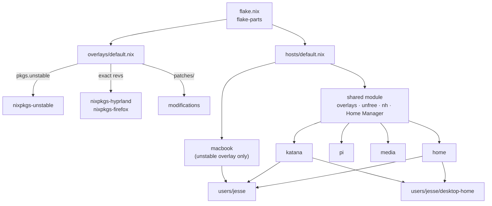

<div align="center">

# ❄️ nix

**One flake, five machines.** NixOS desktop, ThinkPad, Raspberry Pi, media server,
and an Apple-silicon MacBook — declared end to end, dotfiles included.

<p>
  
  
  
  
</p>
<p>
  
  
  
  
  
</p>

</div>

---

## 🖥️ Hosts

| | Host | Machine | Platform | Role |
|:-:|:--|:--|:--|:--|
| 🎮 | **`home`** | Custom desktop, Ryzen 9 9950X3D + NVIDIA | `x86_64-linux` | Daily driver. Hyprland, Secure Boot, dualboots Windows for games. |
| 💼 | **`katana`** | ThinkPad X230 | `x86_64-linux` | Mobile. Same Hyprland desktop, no NVIDIA. |
| 🍓 | **`pi`** | Raspberry Pi 4 | `aarch64-linux` | Always-on LAN box: Samba shares + Docker services. |
| 📺 | **`media`** | Media server, NVIDIA transcode | `x86_64-linux` | Docker media stack over four data disks, hardened SSH. |
| 🍎 | **`macbook`** | Apple silicon | `aarch64-darwin` | nix-darwin. Deliberately minimal, user-scoped. |

---

## 🗂️ Layout

```text
.
├── flake.nix                 inputs + flake-parts entrypoint
├── hosts/
│   ├── default.nix           mkHost / mkDarwinHost, shared module, checks
│   ├── home/                 desktop: boot, wayland, nvidia, scheduler, secure-boot
│   ├── katana/               thinkpad
│   ├── pi/                   samba, docker, systemd units
│   ├── media/                docker, storage, hardening, nvidia
│   └── macbook/              single-file darwin host
├── modules/nixos/            audio · desktop · fonts (shared NixOS bits)
├── users/jesse/              Home Manager: shell, editors, browser, terminal
│   └── desktop-home/         Hyprland (Lua) + Noctalia shell & plugins
├── overlays/default.nix      unstable · pins · modifications · htopVimNavigation
├── patches/<package>/        out-of-tree patches applied by the overlays
└── derivations/              one package directory per script or plugin
```

---

## 🧩 How it fits together



The overlay order matters: `modifications` patches the pinned Hyprland plugin
set, so it must come **after** `pins`. Darwin gets `unstable` and
`htopVimNavigation`, but never the Linux-specific `pins` or `modifications`.

---

## 🎨 Desktop

<table>
<tr><td width="50%" valign="top">

**Compositor**
- Hyprland `0.56.2`, configured in **Lua**
- `hyprbars` + patched `hyprfocus` plugins
- `xdg-desktop-portal-hyprland`, version-asserted

**Shell**
- Noctalia bar with local plugins
  (`control-button`, `hypr-workspaces`)
- Video wallpapers via `mpvpaper`, auto-paused
  behind windows by a user systemd unit

</td><td width="50%" valign="top">

**Look**
- Catppuccin across apps
- Apple fonts (SF Pro / Compact / Mono, NY)
- OpenZone cursors

**Apps**
- Firefox + WaveFox, transparent chrome
- Alacritty · Zed · Neovim · Dolphin · mpv
- zsh + starship, eza / fd / ripgrep

</td></tr>
</table>

---

## 🚀 Build

<details open>
<summary><b>NixOS hosts</b></summary>

First build, from a fresh clone:

```sh
sudo nixos-rebuild switch --flake '.#home'   # home, katana, pi, or media
```

After that [`nh`](https://github.com/nix-community/nh) is installed and knows
where the flake lives; it picks the host from the hostname:

```sh
nh os switch            # also: test, boot
nh os switch --ask      # review the diff first
```

Evaluate or build before you switch:

```sh
nix build '.#nixosConfigurations.home.config.system.build.toplevel'
nix flake check
nixfmt <changed files>
```

</details>

<details>
<summary><b>🍎 MacBook — first activation</b></summary>

Install [Determinate Nix](https://install.determinate.systems/) with its macOS
installer. Determinate owns Nix, its daemon, certificates, and garbage
collection, so the Darwin config intentionally sets `nix.enable = false`.

Homebrew must be installed beforehand — nix-darwin drives the existing `brew`
to install the declared casks, but does not install Homebrew itself.

Verify the account and architecture:

```sh
id -un
dscl . -read "/Users/$(id -un)" NFSHomeDirectory UserShell UniqueID PrimaryGroupID
uname -m
```

Checked-in values are `jmalinosky`, `/Users/jmalinosky`, `aarch64-darwin`. If
the first two differ, update the two local values at the top of
`hosts/macbook/configuration.nix` — do **not** add UID, GID, groups, or shell.

Build and inspect both Home Manager and the full system before activating:

```sh
mac_user="$(id -un)"
nix build ".#darwinConfigurations.macbook.config.home-manager.users.${mac_user}.home.activationPackage"
nix build '.#darwinConfigurations.macbook.system'
```

Then, with a second terminal open, run the release-matched tool explicitly:

```sh
sudo nix run 'github:nix-darwin/nix-darwin/nix-darwin-26.05#darwin-rebuild' -- \
  switch --flake '.#macbook'
```

> ⛔ Do not activate if the build proposes changes to accounts, hostname, system
> profiles, security, network, or unrelated Homebrew inventory.

</details>

<details>
<summary><b>🔐 Secure Boot on <code>home</code></b></summary>

Limine signs its own EFI binary with `sbctl` and checksum-validates kernels and
initrds. One-time setup, before enabling Secure Boot in firmware:

```sh
# 1. put firmware Secure Boot into Setup Mode (clear keys)
sudo nix-shell -p sbctl -- sbctl create-keys
sudo nix-shell -p sbctl -- sbctl enroll-keys -m -f   # -m keeps Windows bootable
nh os switch
sudo sbctl verify
# then re-enable Secure Boot in firmware
```

Signing and hashing happen automatically on every rebuild afterwards.

</details>

---

## ⚠️ Update gotchas

Several inputs are **not** advanced by `nix flake update` — their revision is
embedded in the URL, or they must move as a unit with something else.

| Input(s) | Why it's special |
|:--|:--|
| `nixpkgs` · `home-manager` · `catppuccin` | Pinned to matching release branches. Change the release on all three together. |
| `nixpkgs-hyprland` + `hyprbars` + `hyprfocus` patches | One coupled upgrade: bump the exact rev, rebase every `patches/hyprfocus/*.patch`, update the version assertions, then build `home`. |
| `nixpkgs-firefox` + `wavefox` | WaveFox release must match the Firefox major. Re-check `users/jesse/firefox.nix` (Nova, imported CSS, cascade layers, transparent chrome). |
| `apple-fonts` | Exact commit; its lock records hashes of Apple `.dmg` files that Apple replaces in place. Bump the commit, then `nix flake lock`. |
| `nixos-hardware` | Exact commit; supplies `pi`'s kernel + firmware. Treat a bump as a hardware change and test on the device. |
| NVIDIA driver in `hosts/home/wayland.nix` | Hand-pinned `595.99.02`; version and every hash move as a unit. |

**Never** bump `system.stateVersion` or `home.stateVersion` during a routine
package update — they describe the install's compatibility baseline, not the
current release.

Also: don't hand-edit generated `hardware-configuration.nix` files, don't commit
secrets, and remember that new `.nix` files must be **git-tracked** before flake
evaluation can see them.

---

<div align="center">
<sub>Built with <a href="https://nixos.org">Nix</a> · formatted with <code>nixfmt</code> · linted by <code>statix</code> and <code>deadnix</code></sub>
</div>
